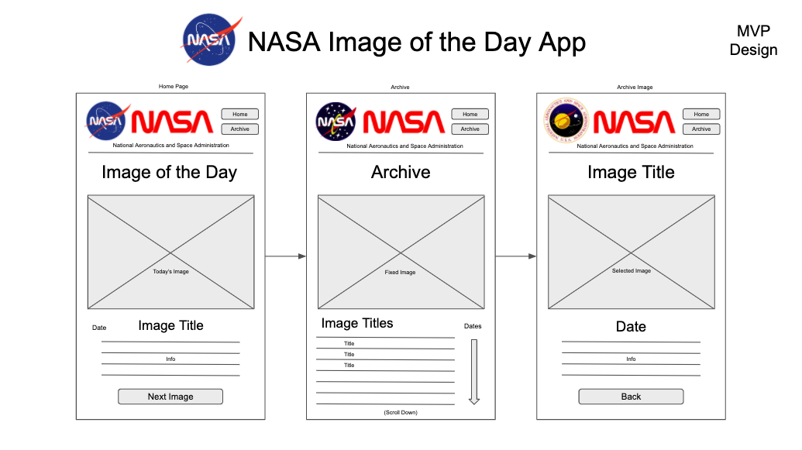
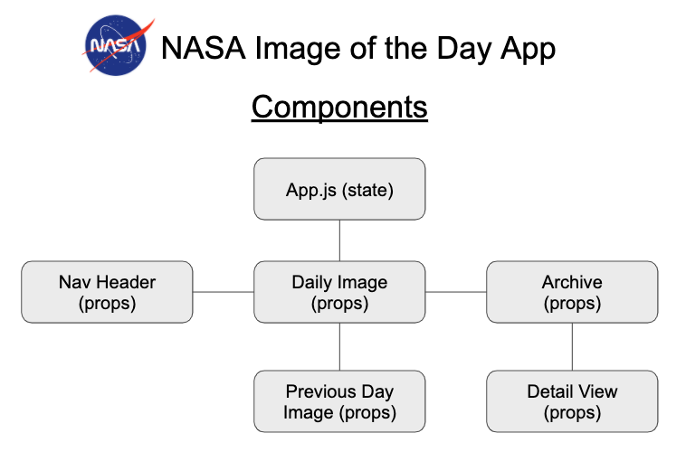
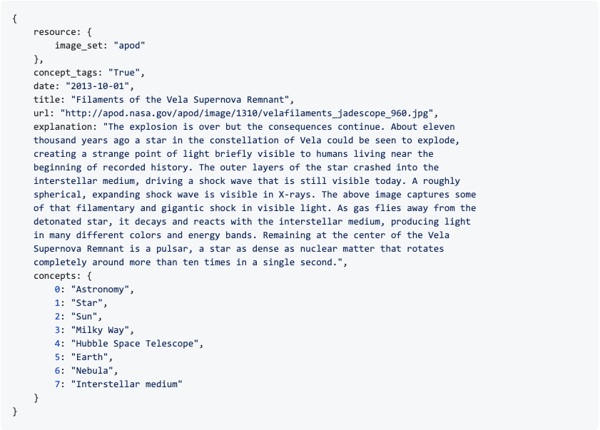

# Dylan Girard - NASA Image of the Day App

## Project Description

This app is a simple, intuitive tool to view NASA's spectacular Astronomy Picture of the Day archive, which features various images of the cosmos. It uses the NASA Astronomy Picture of the Day API, and allows viewing of not only the current image of the day, but navigation to view the archive of images dating all the way back to 2015! If you love space and star gazing, you'll love this app!

The design of the app involves the use of modern software engineering technologies such as React and React Router for streamlined performance. Enjoy!

## Wire Frames

## Component Hierarchy

## APOD Data Example

## User Stories

**Minimum Viable Product Goals**

- As a user, I want to be greeted with today's NASA Astronomy Picture of the Day, because I love space and star gazing.
- As a user, I want to easily navigate to previous images from the home screen with a single button, because I shouldn't have to work too hard to see a few great pictures if I don't have much time to look.
- As a user, I want to see a brief description of the image I'm looking at, so that I can learn more about astronomy.
- As a user I want to have easy, intuitive access to the awesome archive of images going all the way back to 2015, because it's cool to look back at older images too.
- As a user, I want overall navigation of this app to be simple and straight forward, because I don't want to have to think too much about seeing the images that I love.
- As a user, I want to be able to search by day, month, and year, because I'm picky about seeing certain cosmic patterns that only happened during specific time periods.

**Stretch Goals**

- As a user, it would be nice to have the ability to switch between light and dark modes, because bright screens sometimes hurt my eyes.
- As a user, it would be cool to be able to search for images by subject, incase I'm interested in a very specific type of phenomenon.
- As a user I would like to have like/share options for the images I enjoy the most, because I'm interested in the social aspects of star gazing.